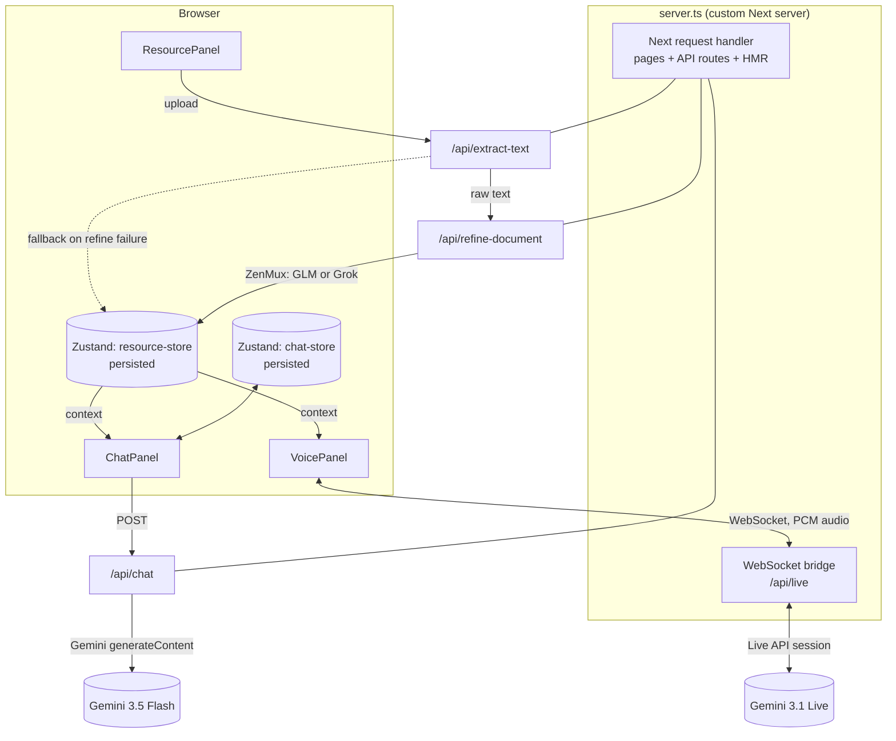

# Paper Talk

A conversational AI workspace: talk to Gemini over text or real-time voice, and ground the conversation in your own uploaded documents. Built on Next.js 16 with a custom server (for the voice WebSocket bridge), Zustand for local state/history, and a three-stage document pipeline (extract → refine → ground) designed to spend AI tokens efficiently.

## Contents

- [How it works](#how-it-works)
  - [1. Text chat](#1-text-chat)
  - [2. Real-time voice call](#2-real-time-voice-call)
  - [3. Resource workspace (document grounding)](#3-resource-workspace-document-grounding)
  - [4. Chat history](#4-chat-history)
- [Architecture](#architecture)
- [Project structure](#project-structure)
- [Environment variables](#environment-variables)
- [Getting started](#getting-started)
- [Scripts](#scripts)
- [Design notes / why things are built this way](#design-notes--why-things-are-built-this-way)
- [Known limitations](#known-limitations)

## How it works

Paper Talk has three surfaces sharing one piece of state — a "system instruction" made of your chosen AI persona plus (optionally) the content of whatever documents you've uploaded:

- **Chat** — text conversation with Gemini
- **Voice call** — real-time duplex audio conversation with Gemini
- **Resource workspace** — upload documents that both of the above can "see"

### 1. Text chat

```
Browser (ChatPanel) → POST /api/chat → Gemini generateContent → reply
```

1. You type a message in `ChatPanel`. The last 10 messages of the active session plus the current system instruction are sent to `app/api/chat/route.ts`.
2. The route calls `gemini-3.5-flash` via `@google/genai`'s `models.generateContent`, using `GEMINI_API_KEY` (server-only — never sent to the browser).
3. The reply is saved into the active chat session (see [Chat history](#4-chat-history)) and rendered as a bubble.

If the request fails (bad key, model overloaded, etc.) the panel shows a friendly fallback message instead of crashing.

### 2. Real-time voice call

Voice can't work as a normal Next.js API route — it needs a persistent, bidirectional WebSocket, which route handlers don't support. So `server.ts` replaces `next dev`/`next start` with a small custom server that:

1. Wraps Next's own request handler for everything (pages, API routes, HMR) — Next.js still does all its normal work.
2. Additionally listens for WebSocket upgrade requests at `/api/live` and bridges them to Gemini's Live API.

```
Mic (browser)
  → 16-bit PCM @16kHz, base64-encoded, chunked over WebSocket
  → server.ts (ws bridge)
  → Gemini Live session (gemini-3.1-flash-live-preview)
  → audio/text/interrupted events
  → server.ts relays back over the same WebSocket
  → browser decodes PCM @24kHz and plays it back gaplessly
```

Concretely, `components/paper-talk/voice-panel.tsx`:

- Captures the mic via `getUserMedia`, feeds it through a `ScriptProcessorNode` (4096-sample buffers) into 16-bit PCM, base64-encodes it, and sends `{ type: "audio", audio }` frames over the socket.
- Plays incoming `{ type: "audio" }` frames through a second `AudioContext` (24kHz) with a gapless scheduling queue (`nextStartTimeRef`), so chunks don't click/gap between them.
- Handles `{ type: "interrupted" }` (user talked over the assistant — stop playback immediately) and `{ type: "error" }` (surface a retry screen).
- Drives a small waveform visualizer off mic amplitude (via an `AnalyserNode`) and a CSS keyframe animation while the assistant is speaking (kept out of the render function on purpose — see [Design notes](#design-notes--why-things-are-built-this-way)).

One important wiring detail in `server.ts`: non-`/api/live` upgrade requests **must** be forwarded to `app.getUpgradeHandler()`, not dropped. Next's own dev-mode HMR/error-overlay also needs a WebSocket; destroying that connection silently breaks the whole page.

### 3. Resource workspace (document grounding)

This is the most involved piece, built specifically to **minimize Gemini token usage** by doing the heavy lifting elsewhere:

```
Upload → /api/extract-text → /api/refine-document → stored in Zustand
                                                          ↓
                                    injected into systemInstruction for
                                       both /api/chat and /api/live
```

**Step 1 — Extraction** (`app/api/extract-text/route.ts`, no AI involved):
- PDF via `pdf-parse` (wraps PDF.js)
- DOCX via `mammoth`
- XLSX/XLS via SheetJS (`xlsx`) — each sheet converted to CSV, sheets joined
- TXT read directly
- Capped at 25 MB input / 60,000 characters of extracted text

**Step 2 — Refinement** (`app/api/refine-document/route.ts` + `lib/refine.ts`):
The raw extracted text is often messy (page numbers, repeated headers, OCR noise). Rather than dumping that raw text straight into every Gemini request (burning tokens on noise, every single message), it's refined **once** into clean, concise markdown documentation by a cheap/free model, and that refined version is what actually gets sent to Gemini from then on.

All refinement providers are routed through [ZenMux](https://zenmux.ai) (one gateway, multiple underlying models) using its Anthropic Messages–compatible API (`x-api-key` header, `system` as a top-level field — different from OpenAI's chat-completions shape). `ACTIVE_MODEL` in `.env` picks between:
- `glm` → `z-ai/glm-4.7-flash-free` (default — benchmarked faster, see below)
- `grok` → `x-ai/grok-4.5-free`

  Benchmarked on the same 2KB document/prompt, 3 runs each: GLM averaged **~5.1s**, Grok averaged **~6.6s** (Grok spends extra time on a hidden reasoning trace that doesn't improve output quality for this task).

**Resilience**: if refinement fails for any reason (bad key, rate limit, provider outage), the resource still becomes usable — it falls back to the raw extracted text rather than losing the upload. The UI shows which happened (a "Refined" badge with a sparkle icon, or a "raw text" label).

**Step 3 — Grounding**: `app/page.tsx` combines every `ready` resource's text (refined, or raw as fallback) into a single context block, capped at 20,000 characters, and appends it to the `systemInstruction` sent to *both* `/api/chat` and the voice WebSocket. This means uploading a document makes both the text chat and the voice assistant able to answer questions about it — no separate wiring needed per surface.

### 4. Chat history

Chat is organized into **sessions** (like a ChatGPT-style history list), not just one running transcript:

- Click the history icon in the left rail (between Voice and Settings) to open a popover: "New chat", a scrollable list of past sessions (title auto-derived from your first message, relative timestamp, message count), select-to-switch, delete.
- Everything is persisted to `localStorage` via Zustand's `persist` middleware — reload the page, history is still there.
- "Clear history" (in the Chat panel header) resets the *current* session's messages; deleting a session from the history list removes it entirely.

Uploaded resources are persisted the same way (extracted + refined *text* only, not the original files — they can't be meaningfully serialized to `localStorage` anyway, and re-persisting text means a page reload doesn't force a second, paid refinement call).

## Architecture



## Project structure

```
app/
  api/
    chat/route.ts             Text chat → Gemini generateContent
    extract-text/route.ts     PDF/DOCX/XLSX/TXT → raw text (no AI)
    refine-document/route.ts  Raw text → refined docs (GLM/Grok via ZenMux)
  page.tsx                    Composes the whole UI, owns view/settings state,
                               builds the effective systemInstruction
  layout.tsx                  Fonts, theme class, suppressHydrationWarning
  globals.css                 Design tokens (oklch palette), keyframes

components/paper-talk/
  nav-rail.tsx                Left icon rail: Chat/Voice nav, history, settings
  top-bar.tsx                 App name, status, workspace toggle
  chat-panel.tsx              Chat UI (bubbles, composer, typing indicator)
  chat-store.ts                └ Zustand store: sessions, persisted, SSR-safe
  voice-panel.tsx             Real-time voice UI (mic capture, playback, states)
  resource-panel.tsx          Upload UI, extract→refine pipeline, status/errors
  resource-store.ts            └ Zustand store: documents, persisted, SSR-safe
  history-panel.tsx           Chat history popover (list/new/select/delete)
  config-panel.tsx            Voice + behavior preset picker (right sidebar)
  presets.ts                  Gemini voice IDs + behavior preset instructions
  logo-mark.tsx               App logo SVG

lib/
  gemini.ts                   Shared Gemini client + model name constants
  refine.ts                   Provider-agnostic refinement client (ZenMux)
  utils.ts                    cn() className helper

components/ui/                shadcn-style primitives (button, dialog, popover,
                               sidebar, bubble, message-scroller, resizable, …)

server.ts                     Custom server: Next handler + /api/live WS bridge
```

## Environment variables

Set these in `.env` (already gitignored — never commit real keys):

| Variable | Used by | Purpose |
|---|---|---|
| `GEMINI_API_KEY` | `lib/gemini.ts`, `server.ts` | Text chat + voice call. Server-only — deliberately **not** prefixed `NEXT_PUBLIC_`, so it's never inlined into the browser bundle. |
| `PROVIDER` | `lib/refine.ts` | ZenMux base URL: `https://zenmux.ai/api/anthropic` |
| `GLM_API_KEY` | `lib/refine.ts` | ZenMux API key (works for every model routed through it, not just GLM) |
| `GLM_MODEL` | `lib/refine.ts` | e.g. `z-ai/glm-4.7-flash-free` |
| `GROK_MODEL` | `lib/refine.ts` | e.g. `x-ai/grok-4.5-free` |
| `ACTIVE_MODEL` | `lib/refine.ts` | `glm` or `grok` — which of the two above is actually used |
| `PORT` | `server.ts` | Optional, defaults to `3000` |

Minimal `.env` to get running:

```bash
GEMINI_API_KEY=your_gemini_key
PROVIDER=https://zenmux.ai/api/anthropic
GLM_API_KEY=your_zenmux_key
GLM_MODEL=z-ai/glm-4.7-flash-free
GROK_MODEL=x-ai/grok-4.5-free
ACTIVE_MODEL=glm
```

Voice and text chat work with just `GEMINI_API_KEY` — the refinement keys only matter once you start uploading documents (and even then, if they're missing/broken, uploads still work via the raw-text fallback).

## Getting started

```bash
npm install
# create .env with the variables above
npm run dev
```

Open [http://localhost:3000](http://localhost:3000). Note: `npm run dev` runs `tsx server.ts`, **not** `next dev` directly — this is required for the voice WebSocket bridge (see [Real-time voice call](#2-real-time-voice-call)). Changes to React components still hot-reload as normal; changes to `server.ts` itself require a manual restart.

## Scripts

| Command | What it does |
|---|---|
| `npm run dev` | Start the custom dev server (Next + WS bridge), Turbopack, HMR |
| `npm run build` | Production build (`next build`) |
| `npm start` | Start the custom server in production mode |
| `npm run lint` | ESLint |

## Design notes / why things are built this way

A few decisions that aren't obvious from reading the code in isolation:

- **Custom server instead of `next dev`**: only way to get a raw HTTP server to attach a `ws` `WebSocketServer` to, for the voice bridge. Must forward non-`/api/live` upgrades to `app.getUpgradeHandler()` or Next's own HMR socket breaks.
- **`serverExternalPackages: ["pdf-parse", "pdfjs-dist"]`** in `next.config.ts`: `pdf-parse` (via PDF.js) resolves a worker file at runtime; Turbopack's server bundling breaks that relative path. Opting these packages out of bundling (native `require` instead) fixes it.
- **`xlsx` installed from `cdn.sheetjs.com`, not npm**: the npm-published `xlsx` package has unpatched high-severity CVEs (prototype pollution, ReDoS) — exactly the attack surface that matters when parsing untrusted uploaded files. SheetJS only ships the patched build via their own CDN.
- **Zustand stores use `skipHydration: true` + manual `rehydrate()` in a `useEffect`**: `persist`'s default behavior reads `localStorage` synchronously at store-creation time on the client, which happens *before* React's hydration match against the server-rendered HTML — guaranteed mismatch on any return visit. Deferring rehydration to a post-mount effect avoids it; the store starts with an identical placeholder on both server and client, then swaps in real data one render later.
- **Voice waveform heights are pure functions of state, not `Date.now()`**: an earlier version computed sinusoidal wiggle with `Math.sin(Date.now() / …)` directly in the render body — flagged by React's `react-hooks/purity` lint rule (impure render output). Replaced with state-driven heights plus a CSS `@keyframes` animation for the "assistant speaking" flourish.
- **Real Gemini voice IDs, not display labels**: the config panel's voice list uses `Zephyr`/`Kore`/`Puck`/`Charon`/`Fenrir` — these are functional identifiers required by Gemini's `prebuiltVoiceConfig.voiceName`, not cosmetic names that can be swapped freely.

## Known limitations

- Chat history and uploaded-resource text are stored in `localStorage` — per-browser only, no cross-device sync, no account system.
- Free-tier refinement models (`*-free` on ZenMux) are rate-limited; heavy document use may eventually hit a rate limit (handled the same way as any other refinement failure — falls back to raw text).
- Switching between Chat and Voice views unmounts the other — an active voice call ends if you navigate away from it.
- `ScriptProcessorNode` (used for mic capture) is a deprecated Web Audio API; still broadly supported in current browsers but could eventually need migrating to `AudioWorkletNode`.
